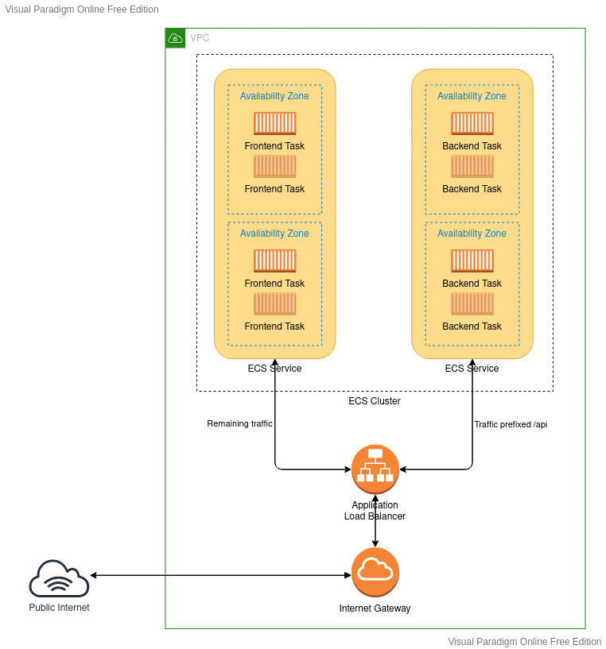

# Assessment

## My solution

My solution is built using [Terraform](https://www.terraform.io/), targets the AWS public cloud and makes use of the Elastic Container Service. All of the code for the infrustructure can be found in the `infrustructure` sub directory in this repository.

### Intial setup

To create the AWS resources in the solution and populate them you will need a few tools installed on your workstation:

  - [AWS CLI](https://aws.amazon.com/cli/)
  - [Terraform](https://www.terraform.io/)
  - [Docker](https://www.docker.com/)

#### Installing the AWS CLI

I recommend following the [instructions in AWS documentation for installing the AWS CLI](https://docs.aws.amazon.com/cli/latest/userguide/getting-started-install.html#cliv2-linux-install) on your workstation.

#### Generate API keys for your AWS account and create the expected profile

NOTE: If you are confident with how terraform and its AWS provider interact you can skip this step. You will need to specify your profile yourself.

The terraform code in his solution is configured to use a profile named `SREAssessment.Infrustructure` by default, so if we set up that profile things will go much smoother. 

 1. Either create a new AWS account or log into your existing one. NOTE: I strongly discourage you from using a root user for this. Consider creating an IAM user with full AWS Administrator permissions instead.
 2. Head to the [Security credentials](https://us-east-1.console.aws.amazon.com/iam/home?region=ap-southeast-2#/security_credentials) in the management console.
 3. Select "Access keys (access key ID and secret access key)".
 4. Click "Create New Access Key" and expand the "Show Access Key" drop down to see your keys.
 5. Make a note of both the Access and Secret key, we need them for the next step.
 6. From a shell on your workstation, run `aws configure --profile SREAssessment.Infrustructure`
 7. Paste in your Access key and Secret key in turn, when prompted.
 8. Set your default region to `ap-southeast-2`.
 9. You can leave the default output format blank. We don't need to use this.

The `SREAssessment.Infrustructure` profile should now be set up and ready to use.

#### Installing Terraform

I recommend following the [instructions on the Terraform downloads page](https://www.terraform.io/downloads) to get Terraform working on your workstation.

#### Initalise Terraform

Before we can use Terraform we need to initalise it. From the root of this respository, change into the `infrustructure` directory and run `terraform init`.

    cd infrustructure
    terraform init

This should have installed the AWS provider and initalised the submodules that make up this infrustructure solution.

#### Installing Docker

I recommend following the [install instructions on the docker website](https://docs.docker.com/engine/install/) to get docker running on your workstation.

Note: You don't actually need Docker Desktop (except on Windows probably), you just need the docker engine and docker compose. I would caution against Docker Desktop if you can avoid it. Consider following the instructions for your specific distribution, [there is a great one for Debian](https://docs.docker.com/engine/install/debian/).

### Host the todo application

#### Create the infrustructure with Terraform

To generate AWS resources we need to run `terraform apply` from the `infrustructure` directory.

    cd infrustructure
    terraform apply

You should be told which resources will be created. Type "yes" to confirm. It will take a few minutes to run, but it should eventually complete successfully return a few variables to you.

Make a note of these varaibles.

elb_hostname is the URL where the application will run from. It should be in the format "clearpoint-todo-alb-ecs-xxxxxxxxx.ap-southeast-2.elb.amazonaws.com". The xxxxxxxxx is a set of numbers that make your address unique.

frontend_registry_url and backend_registry_url are the addresses to push built images to for the application. We will push an images there shortly.

#### Build the docker images

We need to build the docker images we want to publish to AWS on our local workstation. Because we installed docker compose earlier and docker compose is used for the development environment we can use that to build the images.

Because the frontend needs to know the domain that the API runs on to build this into our static assets, we need to specify here too. This will be the elb_hostname we got above, with /api on the end.

    docker compose build --build-arg api_endpoint=/api

This may take a few minutes to run, but once it is successful you should have the frontend and backend images built against your workstation.

#### Tag and push images to the container registries

The Elastic Container Service in AWS will be trying to start tasks using the latest image from the two container registries we created, until they arrive the application cannot run and tasks will be failing to start.

We need to tag the images we built earlier for their destination and then push them up. Before we can push the images though, we must use the AWS CLI to authenticate with the container registry for our AWS account.

To authenticate with the docker registry:

    aws ecr get-login-password --region ap-southeast-2 --profile SREAssessment.Infrustructure | docker login --username AWS --password-stdin <frontend_registry_url>

Where `<frontend_registry_url>` is the URL the terraform returned. (you can actually remove the stuff after the / for this stage, but you don't need to bother)

First the frontend:

    docker tag cptodoui:latest <frontend_registry_url>:latest
    docker push <frontend_registry_url>:latest

Where `<frontend_registry_url>` is the URL the terraform returned.

Then the backend:

    docker tag cptodoapi:latest <backend_registry_url>:latest
    docker push <backend_registry_url>:latest

Where `<backend_registry_url>` is the URL the terraform returned.

### Visit the running application

You should now be able to visit the running application from the elb_hostname URL that the terraform returned earlier.

NOTE: It may take a few minutes for the Elastic Container Service to pick up the latest images you pushed and start the tasks. Once they are running though, you should have a functional application. 

## The application
This repository contains a frontend and a backend service. These services together serve as a ToDo List App.
Read the below documentation for details about each service.

[FrontEnd Readme](Frontend/README.md)

[Backend Readme](Backend/TodoList.Api/README.md)

## The task
> ℹ️ **The task at hand is to deploy the application inside a container or on a vm in a cloud. The application is completely self contained and should not require any additional dependencies to run.**

The end solution should deployable to an empty cloud account/subscription, such as a new AWS account. A person from ClearPoint should be able to deploy the end solution to their cloud account to verify if it works. There should not be a requirement for ClearPoint to access a candidate's cloud services account to deploy this solution.

Candidates should use IaC to deploy the infrastructure required. Please let us know which one would you go for.

Candidates should provide documentation on their solution, including:

* Pre requisites for your deployment solution.
* High level architectural overview of your deployment.
* Process instructions for provisioning your solution.

Please take a look at the [Assessment Grading Criteria](#-assessment-grading-criteria) below.

## Bringing up the app using docker-compose

For testing purposes, the application can be deployed using docker-compose. Running `docker-compose up` from the root directory of this project will build the images and spin up containers for `frontend` and `backend` and the app will be accessible at http://localhost:3000

However, the end solution should provide such infrastructure that would satisfy the [Assessment Grading Criteria](#-assessment-grading-criteria) below.

## Assessment Grading Criteria

##### Key Criteria

The submission should the following criteria:

* Must be able to start from a cloned git repo.
* Must document any pre-requisites clearly.
* Must deploy infrastructure using code.
* Must deploy to a cloud account/subscription.

##### Grading

Candidates will be assessed across the following categories:

##### General Approach

* Clarity of code
* Comments where relevant
* Consistency of Coding

#### Security

* Least Privilege
* Network segmentation (if applicable to the implementation)
* Secret storage (if applicable)
* Platform security features

#### Simplicity

* Do not overengineer the solution

#### Resiliency

* Infrastructure should support Auto scaling and the application should be highly available

#### Bonus points

* Deploy via an automated CICD process.
